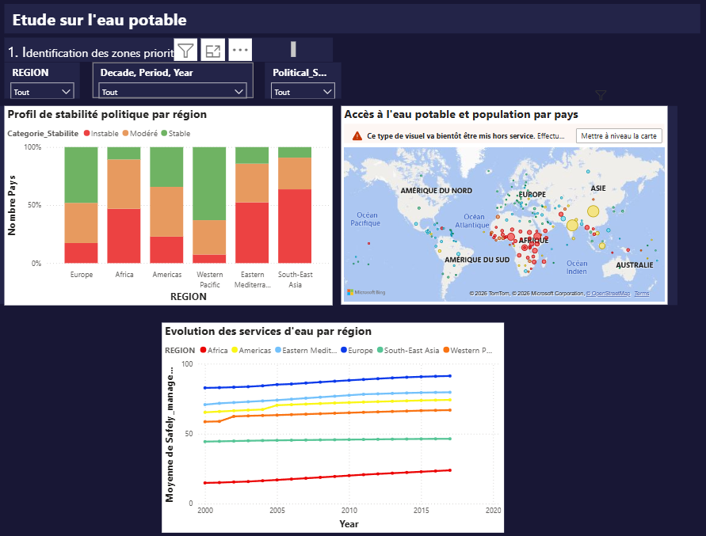

# Etude sur l'eau potable — Dashboard Power BI

**Erika INGABIRE — Data Analyst | Janvier 2026**

---

## Contexte

DWFA (Drinking Water For All) est une ONG internationale dédiée à l'accès universel à l'eau potable. Dans le cadre d'une demande de financement auprès d'un bailleur de fonds, elle a besoin d'identifier le pays cible pour son investissement et de prioriser ses interventions selon ses 3 domaines d'expertise : création de services d'accès à l'eau, modernisation de services existants, et consulting gouvernemental.

---

## Mission

Développer un tableau de bord analytique interactif permettant de :
- Identifier les pays avec des difficultés d'accès à l'eau potable
- Prioriser les efforts selon les 3 domaines d'expertise
- Optimiser l'allocation des futurs financements

---

## Les données

4 sources CSV intégrées via Power Query :

| Source | Contenu |
|--------|---------|
| BasicSafelyandmanagedDrinkingWaterServices | Taux d'accès à l'eau potable par pays (2000–2020), granularité rurale/urbaine/totale |
| Population data | Données démographiques par pays et année |
| Political Stability | Indice de stabilité politique par pays |
| Mortality | Taux de mortalité liée à l'eau insalubre |

Modèle relationnel : schéma en étoile avec une table de faits (FactwaterAccess) et 3 dimensions (Dim_Temps, Dim_Geography, Dim_Granularity).

---

## Dashboard — 3 vues interactives

**Vue Mondiale** — Identification des opportunités d'investissement : carte du monde, stabilité politique par région, évolution temporelle de l'accès à l'eau.

**Vue Continentale** — Analyse comparative : accès basique vs modernisé, relation urbanisation/accès à l'eau, efficacité des politiques gouvernementales.

**Vue Nationale** — Analyse détaillée par pays pour décision d'investissement : évolution temporelle, répartition urbaine/rurale, scores par domaine d'expertise (DAX).

---

## Outils

Power BI · DAX · Power Query · Modélisation relationnelle (schéma en étoile)

---

## Compétences mobilisées

Data visualisation · Modélisation de données · DAX · ETL · Analyse géographique · Storytelling par la donnée
